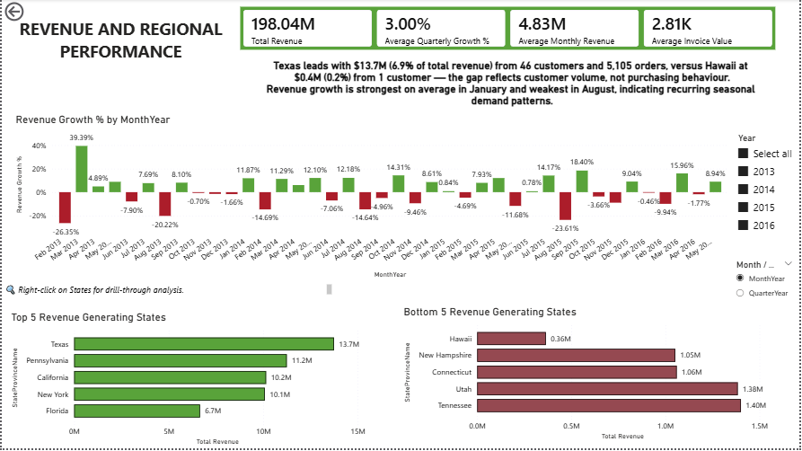
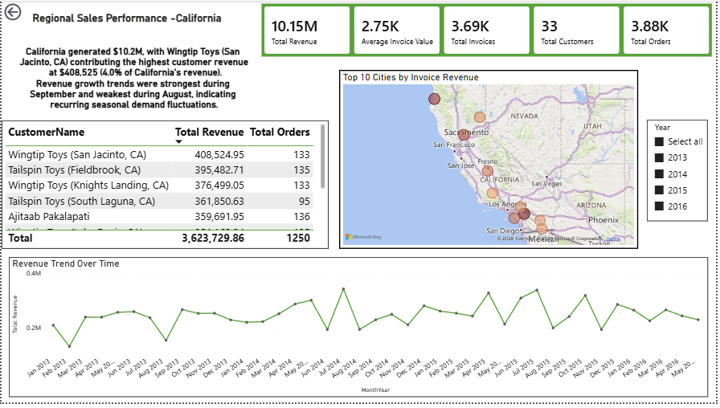
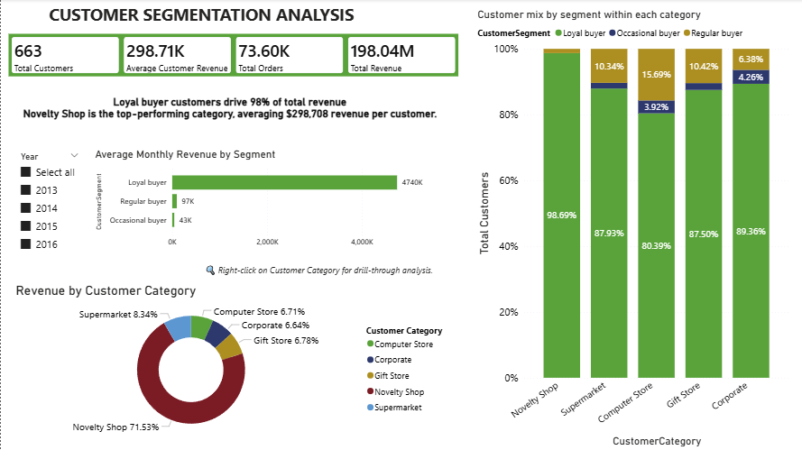
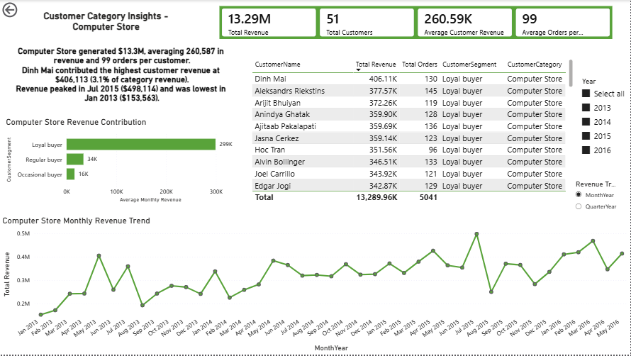
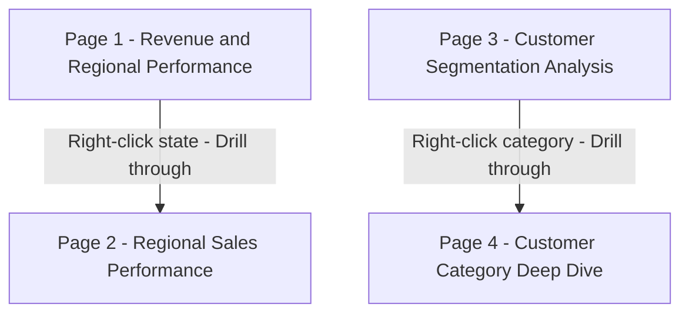

# Wide World Importers Revenue and Customer Segmentation

An interactive 4-page Power BI report analysing revenue performance, regional trends, and customer segmentation across 2013-2016 using the Microsoft WideWorldImporters dataset.

---

## Screenshots

### Page 1 - Revenue and Regional Performance

### Page 2 - Regional Sales Performance (drillthrough)

### Page 3 - Customer Segmentation Analysis

### Page 4 - Customer Category Deep Dive (drillthrough)

---

## Report Architecture

---

## Key Findings

- **Texas** is the top revenue-generating state; **Hawaii** is the lowest
- Revenue growth peaks on average in **April** and dips in **February** - a recurring Q1 slowdown
- The top customer segment drives a disproportionate share of total revenue
- Revenue is concentrated in a small number of urban centres at city level
- Revenue per customer varies significantly across categories, suggesting different purchasing behaviour by segment

---

## Pages at a Glance

| Page | Type | Key Visuals |
|---|---|---|
| Revenue and Regional Performance | Main | Top/bottom state bars, revenue growth % chart, toggle slicer, dynamic insight |
| Regional Sales Performance | Drillthrough | City bubble map, revenue trend, customer table, dynamic insight |
| Customer Segmentation Analysis | Main | Stacked bar, donut chart, avg revenue by segment, dynamic insight |
| Customer Category Deep Dive | Drillthrough | Customer table, revenue and growth % trend, dynamic insight |

---

## DAX Measures

Click to expand - 15 measures in All Measures table

| Measure | What it calculates |
|---|---|
| Sales Revenue | Sum of revenue from Sales Orders - all orders placed |
| Total Revenue | Sum of revenue from Sales InvoiceLines - confirmed billed amounts only |
| Total Orders | Distinct count of OrderIDs from Sales Orders |
| Total Customers | Distinct count of CustomerIDs in context |
| Total Invoices | Distinct count of InvoiceIDs in context |
| Average Invoice Value | Invoice Revenue divided by Total Invoices |
| Average Monthly Revenue | Average revenue per calendar month |
| Average Quarterly Growth % | Average revenue growth rate per quarter |
| Average Customer Revenue | Total Revenue divided by Total Customers |
| Average Order per Customer | Total Orders divided by Total Customers |
| Revenue Growth % | Period-over-period growth via DATEADD, auto-detects month or quarter grain via ISINSCOPE |
| Dynamic Revenue Main Insight | Text measure - top/bottom state and peak/low growth months |
| Regional Insight | Text measure - regional revenue, orders, peak and low months |
| Dynamic Customer Segmentation Insight | Text measure - top segment share and category efficiency |
| Dynamic Category Insight | Text measure - category revenue, averages, and top customer contribution |

> Note: Total Revenue and Invoice Revenue are intentionally separate. Not all orders in WWI are immediately invoiced. Sales Revenue reflects all orders placed; Total Revenue reflects confirmed billed amounts. Segmentation and state-level pages use Total Revenue as it better represents realised business performance.

---

## Technical Highlights

- **Drillthrough navigation** - two drillthrough pairs connecting summary pages to detail pages
- **Month/quarter toggle** - disconnected parameter table driving a field parameter slicer
- **Dynamic DAX insights** - three text measures using TOPN, SELECTEDVALUE, AVERAGEX, and CONCATENATEX to generate context-aware narrative cards
- **Synced slicers** - year slicer on Page 1 syncs silently to Page 2 drillthrough
- **Custom date table** - marked as date table with MonthNum and MonthSort columns for correct time intelligence
- **Centralised measure table** - all 15 DAX measures in one All Measures table

---

## Data Model

Data imported from the WideWorldImporters SQL Server database. Key tables used:

- Sales Orders and Sales OrderLines - order and line-level data
- Sales Invoices and Sales InvoiceLines - invoiced revenue
- Sales Customers  - customers
- Application StateProvinces and Application Cities - geographic dimensions
- DateTable - custom date table
- Sales Customer Segmentation - customer segments imported from sql query
- Category revenue trend toggle - disconnected parameter table for month vs quarter slicer

---

## How to Open

1. Download `WWI_Revenue_and_Customer segmentation.pbix` from this repository
2. Open in [Power BI Desktop](https://powerbi.microsoft.com/desktop) (free)
3. The data is imported as a static snapshot - no SQL Server connection required

---

## Related Projects

- [WWI SQL Portfolio](../WWI-SQL-Portfolio) - four SQL projects on the same dataset covering data profiling, sales performance, customer segmentation and revenue trend analysis.

---

Built by Nivethitha Selvaraj | Data Analyst | Vancouver, Canada
[Connect on LinkedIn](https://www.linkedin.com/in/nivethitha-s/)
