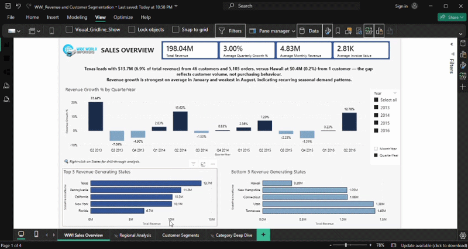
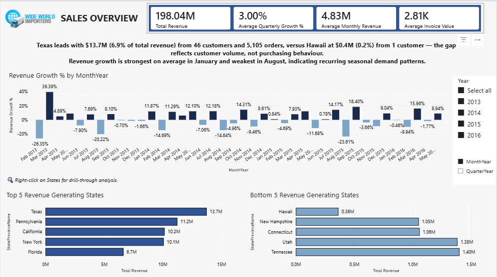
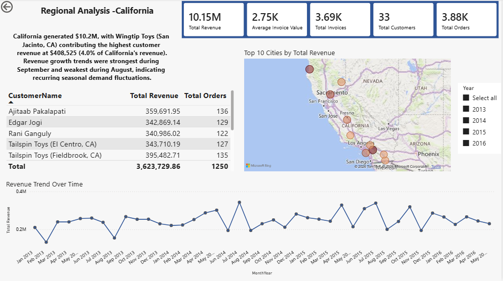
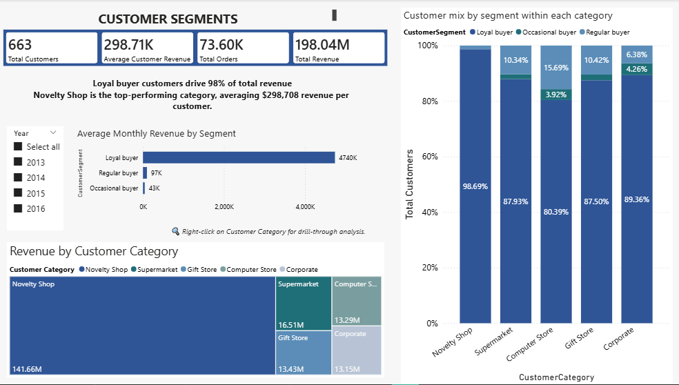
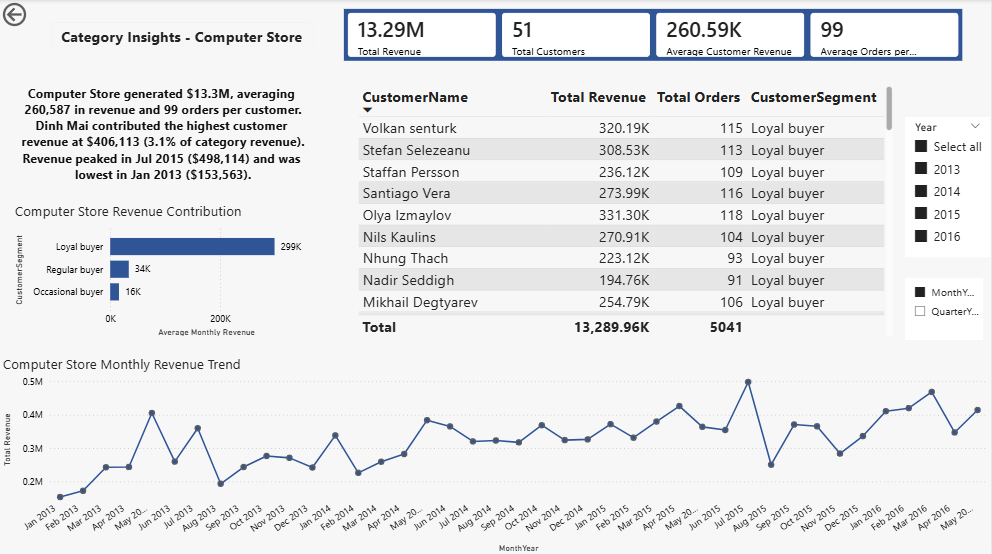
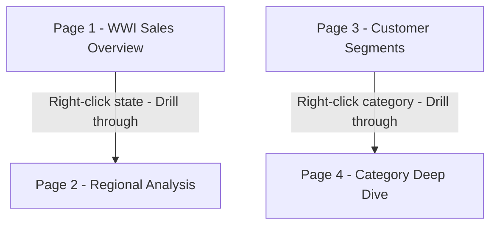

# Wide World Importers Revenue and Customer Segmentation

An interactive 4-page Power BI report analysing revenue performance, regional trends, and customer segmentation across 2013-2016 using the Microsoft WideWorldImporters dataset.

---
## Dashboard Walkthrough

[Watch Full Dashboard Walkthrough](dashboard_video/full_dashboard_walkthrough.mp4)

## Screenshots

### Page 1 - WWI Sales Overview

### Page 2 - Regional Analysis (drillthrough)

### Page 3 - Customer Segments

### Page 4 - Category Deep Dive (drillthrough)

---

## Report Architecture

---

## Key Findings

- **Texas leads all states** with $13.7M in revenue from 46 customers and 5,100 orders, versus Hawaii at $0.4M from a single customer. The gap reflects customer volume, not purchasing behaviour, with Hawaii's sole customer still generating strong per-customer revenue consistent with WWI's B2B wholesale model
- **Revenue growth peaks in January and dips in August** across all years, suggesting post-holiday restocking drives Q1 demand. A pattern typical of novelty goods wholesale where retailers reorder after peak retail seasons
- **Loyal Buyers drive 98% of total revenue** across all segments, indicating extreme concentration with negligible contribution from other customer types, reflecting WWI's repeat B2B buyer base
- **Novelty Shop customers** generate the highest average revenue per customer at $308.63K over 2013-2016, outperforming Computer Store ($260.59K) by 18%, consistent with WWI's core novelty and toy product focus aligning most naturally with gift and novelty retailers
- **Average quarterly growth of 3%** across 2013-2016 indicates steady expansion, with WWI maintaining consistent demand across its wholesale customer base

---

## Pages at a Glance

| Page | Type | Key Visuals |
|---|---|---|
| WWI Sales Overview | Main | 4 KPI cards, dynamic insight, revenue growth % by MonthYear chart, month/quarter toggle slicer, top 5 and bottom 5 revenue generating states bars |
| Regional Analysis | Drillthrough | 5 KPI cards, dynamic insight, customer revenue table with total revenue and total orders, top 10 cities bubble map, revenue trend over time line chart, year slicer |
| Customer Segments | Main | 4 KPI cards, dynamic insight, average monthly revenue by segment bar, revenue by customer category donut chart, customer mix by segment within each category 100% stacked bar, year slicer |
| Category Deep Dive | Drillthrough | 4 KPI cards, dynamic insight, customer revenue contribution by segment bar, customer detail table with revenue/orders/segment/category, monthly revenue trend line chart, month/quarter toggle slicer, year slicer |

---

## DAX Measures

Click to expand - 14 measures in All Measures table

| Measure | What it calculates | Pages used |
|---|---|---|
| Total Revenue | SUM of ExtendedPrice from Sales InvoiceLines - confirmed billed revenue | All pages |
| Total Orders | Distinct count of OrderIDs from Sales Orders | Pages 2, 3, 4 |
| Total Customers | Distinct count of CustomerIDs in context | Pages 2, 3, 4 |
| Total Invoices | Distinct count of InvoiceIDs in context | Page 2 |
| Average Invoice Value | Total Revenue divided by Total Invoices | Pages 1, 2 |
| Average Monthly Revenue | Average revenue per calendar month | Pages 1, 3, 4 |
| Average Quarterly Growth % | Average revenue growth rate per quarter | Page 1 |
| Average Customer Revenue | Total Revenue divided by Total Customers | Pages 3, 4 |
| Average Order per Customer | Total Orders divided by Total Customers | Page 4 |
| Revenue Growth % | Period-over-period growth via DATEADD, auto-detects month or quarter grain via ISINSCOPE | Pages 1, 4 |
| Dynamic Revenue Main Insight | Text measure - top/bottom state with customer and order counts, revenue share, and peak/low growth months | Page 1 |
| Regional Insight | Text measure - regional revenue, orders, peak and low revenue months | Page 2 |
| Dynamic Customer Segmentation Insight | Text measure - top segment share and top category revenue per customer | Page 3 |
| Dynamic Category Insight | Text measure - category revenue, averages, top customer contribution with percentage share, and peak and low revenue months | Page 4 |

---

## Technical Highlights

- **Drillthrough navigation** - two drillthrough pairs connecting summary pages to detail pages
- **Month/quarter toggle** - disconnected parameter table driving a field parameter slicer across pages
- **Dynamic DAX insights** - four context-aware text measures using TOPN, SELECTEDVALUE, AVERAGEX, ADDCOLUMNS, FILTER, and CONCATENATEX to generate narrative cards that update with every filter selection
- **Customer and order volume context** - Dynamic Revenue Main Insight calculates customer and order counts per state dynamically using FILTER(ALL()) to override page filter context
- **Synced slicers** - year slicer on Page 1 syncs silently to Page 2 drillthrough via Power BI sync slicer panel
- **Custom date table** - marked as date table with MonthNum, MonthYearSort, and QuarterYearSort columns for correct time intelligence and axis ordering
- **Centralised measure table** - all 14 DAX measures in one All Measures table, none scattered across fact tables

---

## Data Model

Data imported from the WideWorldImporters SQL Server database. Key tables used:

- Sales Orders and Sales OrderLines - order and line-level data
- Sales InvoiceLines - source for all revenue calculations
- Sales Customers - customer master
- Sales Customer Segmentation - customer segments built from a custom SQL query
- Application StateProvinces and Application Cities - geographic dimensions
- DateTable - custom date table with Year, MonthYear, MonthName, MonthNum, MonthYearSort, QuarterYear, Quarter, QuarterYearSort columns
- Month / Qtr Toggle - disconnected parameter table for month vs quarter slicer

---
# Wide World Importers Dataset

## About the Data
* **Source:** Microsoft Sample Datasets
* **Original Database:** Wide World Importers (WWI)
* **Type:** Relational database representing a wholesale novelty goods importer.

## Access the Original Data
Since the backup file exceeds GitHub's standard file size limits, you can download the original `.bak` file directly from Microsoft using the first link.
* [Download Wide World Importers-Standard.bak](https://github.com/microsoft/sql-server-samples/releases/download/wide-world-importers-v1.0/WideWorldImporters-Standard.bak)
* [Wide World Importers Dataset Source Link](https://github.com/microsoft/sql-server-samples/releases/tag/wide-world-importers-v1.0)

## How to Restore
1. Download the `WideWorldImporters-Standard.bak` file.
2. Move it to your SQL Server backup directory.
3. Open SQL Server Management Studio (SSMS) and run the restore wizard.

## How to Open

1. Download `WWI_Revenue_and_Customer_Segmentation.pbix` from this repository.
2. Open in [Power BI Desktop](https://powerbi.microsoft.com/desktop) (free)
3. The PBIX file contains an imported snapshot of the dataset, so the report can be viewed without connecting to SQL Server.

---

## Related Projects

- [WWI SQL Portfolio](https://github.com/nive710/WWI-SQL-Portfolio) - four SQL projects on the same dataset covering data profiling, sales performance, customer segmentation, and revenue trend analysis

---

Built by Nivethitha Selvaraj | Data Analyst | Vancouver, Canada
[Connect on LinkedIn](https://www.linkedin.com/in/nivethitha-s/)

