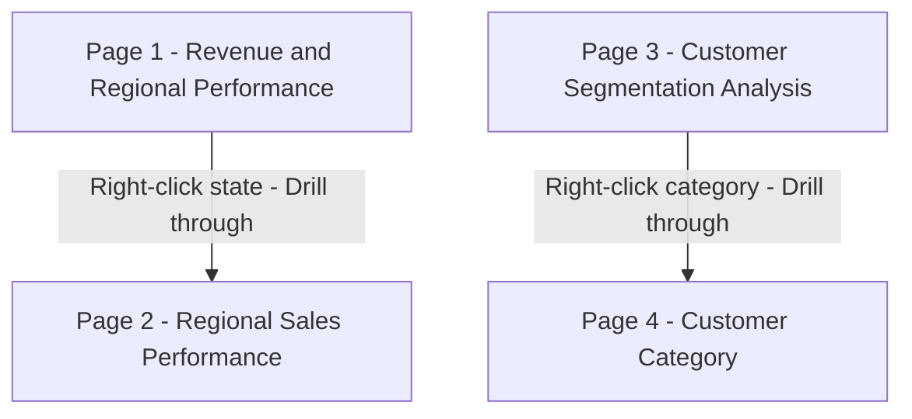

# Wide World Importers Revenue and Customer Segmentation

An interactive 4-page Power BI report analysing revenue performance, regional trends, and customer segmentation across 2013-2016 using the Microsoft WideWorldImporters dataset.

---

## Screenshots

### Page 1 - Revenue and Regional Performance

### Page 2 - Regional Sales Performance (drillthrough)

### Page 3 - Customer Segmentation Analysis

### Page 4 - Customer Category (drillthrough)

---

## Report Architecture

---

## Key Findings

Texas, Pennsylvania, and California are the top three revenue-generating states, collectively accounting for ~18% of total revenue — driven by customer volume rather than per-customer value, consistent with WWI's broad B2B wholesale distribution model
Hawaii's single customer generated $0.4M across 2013-2016, demonstrating that even the smallest market produces high per-customer revenue — reflecting the loyalty and purchasing power of WWI's B2B buyer base
Loyal Buyers drive 98% of total revenue across all segments — indicating extreme segment concentration with negligible contribution from other customer types
Novelty Shop customers generate the highest average revenue per customer at $308.63K, outperforming Computer Store ($260.59K) by 18% over the 2013-2016 period
Revenue growth peaks in January and dips in August across all years, suggesting post-holiday restocking drives Q1 demand — a pattern typical of novelty goods wholesale
---

## Pages at a Glance

| Page | Type | Key Visuals |
|---|---|---|
| Revenue and Regional Performance | Main | Top/bottom state bars, revenue growth % chart, toggle slicer, dynamic insight |
| Regional Sales Performance | Drillthrough | City bubble map, revenue trend line, customer table, dynamic insight |
| Customer Segmentation Analysis | Main | Stacked bar, donut chart, avg revenue by segment bar, dynamic insight |
| Customer Category | Drillthrough | Customer table, revenue and growth % trend line, dynamic insight |

---

## DAX Measures

Click to expand - 14 measures in All Measures table

| Measure | What it calculates | Pages used |
|---|---|---|
| Total Revenue | SUM of ExtendedPrice from Sales InvoiceLines - confirmed billed revenue | All pages |
| Total Orders | Distinct count of OrderIDs from Sales Orders | Pages 2, 3, 4 |
| Total Customers | Distinct count of CustomerIDs in context | Pages 2, 3, 4 |
| Total Invoices | Distinct count of InvoiceIDs in context | Page 2 |
| Average Invoice Value | Total Revenue divided by Total Invoices | Pages 1, 2 |
| Average Monthly Revenue | Average revenue per calendar month | Pages 1, 3, 4 |
| Average Quarterly Growth % | Average revenue growth rate per quarter | Page 1 |
| Average Customer Revenue | Total Revenue divided by Total Customers | Pages 3, 4 |
| Average Order per Customer | Total Orders divided by Total Customers | Page 4 |
| Revenue Growth % | Period-over-period growth via DATEADD, auto-detects month or quarter grain via ISINSCOPE | Pages 1, 4 |
| Dynamic Revenue Main Insight | Text measure - top/bottom state and peak/low average growth months | Page 1 |
| Regional Insight | Text measure - regional revenue, orders, peak and low revenue months | Page 2 |
| Dynamic Customer Segmentation Insight | Text measure - top segment share and top category revenue per customer | Page 3 |
| Dynamic Category Insight | Text measure - category revenue, averages, top customer contribution with percentage share, and peak and low revenue months | Page 4 |

---

## Technical Highlights

- **Drillthrough navigation** - two drillthrough pairs connecting summary pages to detail pages
- **Month/quarter toggle** - disconnected parameter table driving a field parameter slicer across pages
- **Dynamic DAX insights** - four text measures using TOPN, SELECTEDVALUE, AVERAGEX, ADDCOLUMNS, and CONCATENATEX to generate context-aware narrative cards
- **Synced slicers** - year slicer on Page 1 syncs silently to Page 2 drillthrough
- **Custom date table** - marked as date table with MonthNum and MonthYearSort columns for correct time intelligence
- **Centralised measure table** - all 14 DAX measures in one All Measures table, none scattered across fact tables

---

## Data Model

Data imported from the WideWorldImporters SQL Server database. Key tables used:

- Sales Orders and Sales OrderLines - order and line-level data
- Sales InvoiceLines - source for all revenue calculations
- Sales Customers - customer master
- Sales Customer Segmentation - customer segments built from a custom SQL query
- Application StateProvinces and Application Cities - geographic dimensions
- DateTable - custom date table with Year, MonthYear, MonthName, MonthNum, QuarterYear, Quarter, MonthYearSort columns
- Month / Qtr Toggle - disconnected parameter table for month vs quarter slicer

---

## How to Open

1. Download `WWI_Revenue_and_Customer_Segmentation.pbix` from this repository
2. Open in [Power BI Desktop](https://powerbi.microsoft.com/desktop) (free)
3. The data was imported from WideWorldImporters SQL Server and is embedded as a static snapshot - no database connection required

---

## Related Projects

- [WWI SQL Portfolio](../WWI-SQL-Portfolio) - four SQL projects on the same dataset covering data profiling, sales performance, customer segmentation, and revenue trend analysis

---

Built by Nivethitha Selvaraj | Data Analyst | Vancouver, Canada
[Connect on LinkedIn](https://www.linkedin.com/in/nivethitha-s/)

